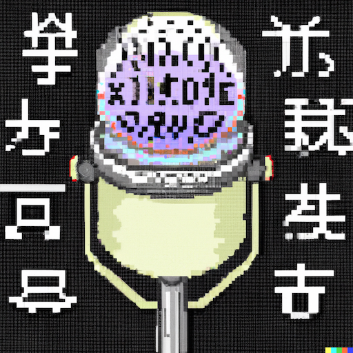

# 🎙️ SpeechLine

    
    
    
    
    
    

SpeechLine is a speech labeling pipeline that handles end-to-end, offline, batch audio categorization, transcription, segmentation, and logging.

    

## Pipeline Overview

    
    

## Available Modules

    
    

    Figure inspired by <a href="https://maartengr.github.io/BERTopic/algorithm/algorithm.html">BERTopic's Modularity Diagram</a>

## Examples

- [SpeechLine on AWS SageMaker](./docs/examples/sagemaker.md)

## Contributors

