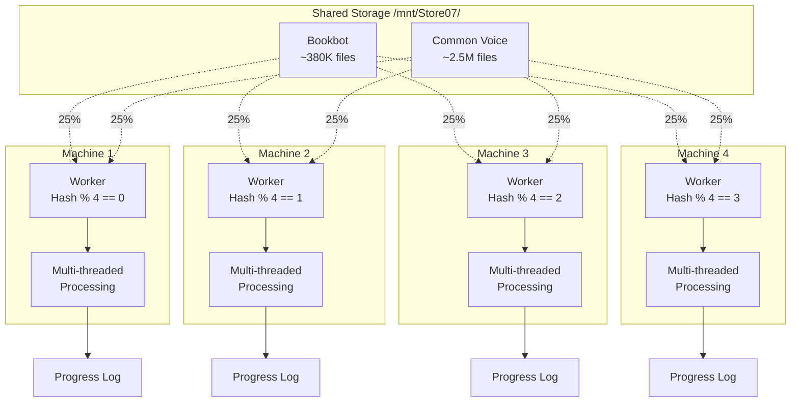

# Distributed Multi-Threaded Processing Architecture

## Overview

Architecture for processing **2.5M+ audio files** across **4 machines** with filesystem-based coordination, optimized for **maximum speed**.

## System Requirements

- **Machines**: 4 systems with varying specs
- **Storage**: Shared network storage (`/mnt/Store07/`)
- **Coordination**: Filesystem-based (no external services)
- **Priority**: Maximum speed with basic fault tolerance

---

## Architecture Design

### Strategy: Hash-Based Partitioning

Files are **deterministically assigned** to machines using hash partitioning. Each machine processes its assigned partition independently with multi-threading.



---

## Key Features

### ✅ No Coordination Overhead
- Each machine independently processes its partition
- No file locking, no queues, no coordination needed
- Deterministic assignment: `hash(filename) % 4 == machine_id`

### ✅ Automatic Load Balancing
- Hash function naturally distributes files evenly
- Each machine gets ~25% of files regardless of directory structure

### ✅ Fault Tolerant
- Progress files track completed files
- Failed machines can be restarted - they skip already-processed files
- Work can be redistributed manually if needed

### ✅ Multi-Threaded Processing
- Each machine spawns multiple threads (configurable)
- Threads share the Gentle aligner instance
- Optimal thread count = (CPU cores - 1) or 4-8 for network storage

### ✅ Progress Monitoring
- Each machine writes progress to separate log files
- Simple monitoring script aggregates progress
- Real-time speed and ETA calculations

---

## File Structure

```
/mnt/Store07/processing/
├── bookbot/
│   ├── progress/
│   │   ├── machine_0.log       # Progress log for machine 0
│   │   ├── machine_1.log       # Progress log for machine 1
│   │   ├── machine_2.log       # Progress log for machine 2
│   │   └── machine_3.log       # Progress log for machine 3
│   └── completed/
│       ├── machine_0.txt       # List of completed files
│       ├── machine_1.txt
│       ├── machine_2.txt
│       └── machine_3.txt
├── common_voice/
│   ├── progress/
│   │   ├── machine_0.log
│   │   ├── machine_1.log
│   │   ├── machine_2.log
│   │   └── machine_3.log
│   └── completed/
│       ├── machine_0.txt
│       ├── machine_1.txt
│       ├── machine_2.txt
│       └── machine_3.txt
└── review/
    ├── bookbot_invalid.txt     # Aggregated invalid files
    └── cv_invalid.txt          # Aggregated invalid files
```

---

## Implementation Components

### 1. Distributed Worker Script

Each machine runs the same script with a different `--machine-id`:

```bash
# Machine 0
python scripts/distributed_phoneme_worker.py \
    --machine-id 0 \
    --total-machines 4 \
    --dataset bookbot \
    --data-path /mnt/Store07/Bookbot \
    --threads 8

# Machine 1  
python scripts/distributed_phoneme_worker.py \
    --machine-id 1 \
    --total-machines 4 \
    --dataset bookbot \
    --data-path /mnt/Store07/Bookbot \
    --threads 6

# ... and so on for machines 2 and 3
```

**Worker behavior:**
1. Scans all files in the dataset
2. Filters to only files where `hash(filename) % 4 == machine_id`
3. Checks completed files list to skip already-processed
4. Spawns thread pool for parallel processing
5. Writes progress every N files
6. Handles graceful shutdown on Ctrl+C

### 2. Progress Monitor Script

Aggregates progress from all machines:

```bash
python scripts/monitor_distributed_progress.py \
    --dataset bookbot \
    --watch
```

**Shows:**
- Files processed per machine
- Combined progress percentage
- Current processing speed (files/hour)
- Estimated time to completion
- Invalid file count

### 3. Resume/Restart Script

Handles failures and restarts:

```bash
# Restart specific machine
python scripts/distributed_phoneme_worker.py \
    --machine-id 2 \
    --resume

# Redistribute work from failed machine
python scripts/redistribute_work.py \
    --failed-machine 2 \
    --redistribute-to 0,1,3
```

---

## Processing Flow

### Phase 1: Setup (Run once)

```bash
# On management machine
python scripts/setup_distributed_processing.py \
    --datasets bookbot,common_voice \
    --machines 4
```

Creates directory structure and initializes progress tracking.

### Phase 2: Start Workers (On each machine)

```bash
# Machine 0
python scripts/distributed_phoneme_worker.py \
    --machine-id 0 --total-machines 4 \
    --dataset bookbot --threads 8

# Machine 1
python scripts/distributed_phoneme_worker.py \
    --machine-id 1 --total-machines 4 \
    --dataset bookbot --threads 6

# Machine 2
python scripts/distributed_phoneme_worker.py \
    --machine-id 2 --total-machines 4 \
    --dataset bookbot --threads 8

# Machine 3
python scripts/distributed_phoneme_worker.py \
    --machine-id 3 --total-machines 4 \
    --dataset bookbot --threads 4
```

### Phase 3: Monitor Progress

```bash
# On any machine with access to shared storage
watch -n 5 python scripts/monitor_distributed_progress.py --dataset bookbot
```

### Phase 4: Handle Failures

If a machine fails:

1. **Automatic resume**: Simply restart the worker on the same machine
   ```bash
   python scripts/distributed_phoneme_worker.py \
       --machine-id 2 --total-machines 4 \
       --dataset bookbot --threads 8 --resume
   ```

2. **Manual redistribution** (optional): Reassign failed machine's remaining work
   ```bash
   python scripts/redistribute_work.py \
       --failed-machine 2 \
       --redistribute-to 0,1,3
   ```

---

## Performance Estimates

### Bookbot (~380K files)

| Machine Count | Threads/Machine | Files/Hour | Total Time |
|---------------|-----------------|------------|------------|
| 4 | 4-8 | ~40K | ~10 hours |
| 4 | 8-12 | ~60K | ~6-7 hours |

### Common Voice (~2.5M files)

| Machine Count | Threads/Machine | Files/Hour | Total Time |
|---------------|-----------------|------------|------------|
| 4 | 4-8 | ~40K | ~65 hours (~3 days) |
| 4 | 8-12 | ~60K | ~42 hours (~2 days) |

**Note**: Actual speed depends on:
- CPU speed and core count
- Network storage speed (bottleneck for multi-threading)
- Audio file sizes
- Transcript complexity

---

## Thread Count Recommendations

### For Network Storage (Shared /mnt/Store07/)

**Conservative** (recommended for stability):
- 16+ cores: 6-8 threads
- 8-15 cores: 4-6 threads  
- 4-7 cores: 2-4 threads

**Aggressive** (maximum speed, may saturate network):
- 16+ cores: 10-12 threads
- 8-15 cores: 6-8 threads
- 4-7 cores: 4-6 threads

### For Local Storage

If copying data locally first:
- Use threads = (CPU cores - 2) for maximum speed
- Network storage is usually the bottleneck, not CPU

---

## Advantages of This Architecture

1. **✅ Maximum Speed**
   - No coordination overhead
   - Parallel processing across 4 machines
   - Multi-threading within each machine
   - Linear scalability (4x machines ≈ 4x speed)

2. **✅ Simple Filesystem Coordination**
   - No external services (Redis, database)
   - Simple text files for progress tracking
   - Easy to debug and monitor

3. **✅ Fault Tolerant**
   - Machines can fail and restart
   - Progress preserved in files
   - No data loss on crashes

4. **✅ Flexible**
   - Easy to add/remove machines
   - Thread count adjustable per machine
   - Can pause/resume anytime

5. **✅ Deterministic**
   - Same file always assigned to same machine
   - Reproducible results
   - No race conditions

---

## Alternative: Batch File Approach

If hash-based partitioning has issues, alternative approach:

### Pre-split into batch files:

```bash
python scripts/create_batch_files.py \
    --dataset bookbot \
    --batch-size 5000 \
    --output batches/
```

Creates: `batch_0001.txt`, `batch_0002.txt`, etc.

### Workers claim batches:

```bash
python scripts/batch_worker.py \
    --batch-dir batches/ \
    --threads 8
```

Each worker:
1. Atomically claims next available batch (rename to `.processing`)
2. Processes all files in batch
3. Marks batch as complete (rename to `.done`)
4. Claims next batch

**Tradeoffs:**
- ✅ More flexible load balancing
- ✅ Easy to redistribute work
- ❌ Requires batch coordination (file renames)
- ❌ Slightly more complex

---

## Monitoring and Debugging

### Real-time Progress

```bash
# Watch progress (updates every 5 seconds)
watch -n 5 python scripts/monitor_distributed_progress.py \
    --dataset bookbot --detailed

# Output shows:
# Machine 0: 23,450/95,000 (24.7%) - 2,340 files/hour
# Machine 1: 22,100/95,000 (23.3%) - 2,210 files/hour  
# Machine 2: 24,890/95,000 (26.2%) - 2,489 files/hour
# Machine 3: 21,560/95,000 (22.7%) - 2,156 files/hour
# ──────────────────────────────────────────────────────
# Total: 92,000/380,000 (24.2%) - 9,195 files/hour
# ETA: 31.3 hours
# Invalid: 2,340 files (2.5%)
```

### Check Machine Health

```bash
# Check if all machines are active
python scripts/check_worker_health.py --dataset bookbot

# Output:
# Machine 0: ACTIVE (last update: 2s ago)
# Machine 1: ACTIVE (last update: 1s ago)
# Machine 2: STALLED (last update: 5m ago) ⚠️
# Machine 3: ACTIVE (last update: 3s ago)
```

### Aggregate Invalid Files

```bash
# Collect all invalid transcripts for review
python scripts/aggregate_invalid_files.py \
    --dataset bookbot \
    --output review/bookbot_invalid.txt
```

---

## Troubleshooting

### Problem: Machine is slower than others

**Solution**: Adjust thread count or redistribute work
```bash
# Reduce threads if CPU-bound
--threads 4

# Increase threads if I/O-bound (network storage has bandwidth)
--threads 12
```

### Problem: Network storage saturated

**Symptoms**: All machines slow, high network latency

**Solutions**:
1. Reduce total thread count across all machines
2. Copy datasets to local storage on each machine
3. Process in sequential phases (Bookbot first, then CV)

### Problem: Machine failed mid-processing

**Solution**: Simply restart with same parameters
```bash
python scripts/distributed_phoneme_worker.py \
    --machine-id 2 --total-machines 4 \
    --dataset bookbot --threads 8
```

Worker automatically:
- Reads completed files list
- Skips already-processed files
- Continues from where it left off

### Problem: Want to rebalance work

**Solution**: Use redistribute script
```bash
# Machine 2 is idle, redistribute its remaining work
python scripts/redistribute_work.py \
    --source-machine 2 \
    --target-machines 0,1,3
```

---

## Next Steps

1. **Create distributed worker script** (`distributed_phoneme_worker.py`)
2. **Create progress monitor** (`monitor_distributed_progress.py`)
3. **Create setup script** (`setup_distributed_processing.py`)
4. **Test on small subset** (100 files per machine)
5. **Tune thread counts** based on actual performance
6. **Run full Bookbot processing** (~10 hours)
7. **Run full Common Voice processing** (~2-3 days)

---

## Summary

This architecture provides:
- ✅ **Maximum speed** through multi-machine + multi-threaded processing
- ✅ **Simple filesystem coordination** with no external dependencies
- ✅ **Fault tolerance** with automatic resume capabilities
- ✅ **Easy monitoring** with progress tracking and health checks
- ✅ **Flexibility** to add/remove machines or adjust parameters

**Expected processing time**: 
- Bookbot: ~6-10 hours
- Common Voice: ~2-3 days
- **Total: ~3 days** for 2.5M files across 4 machines