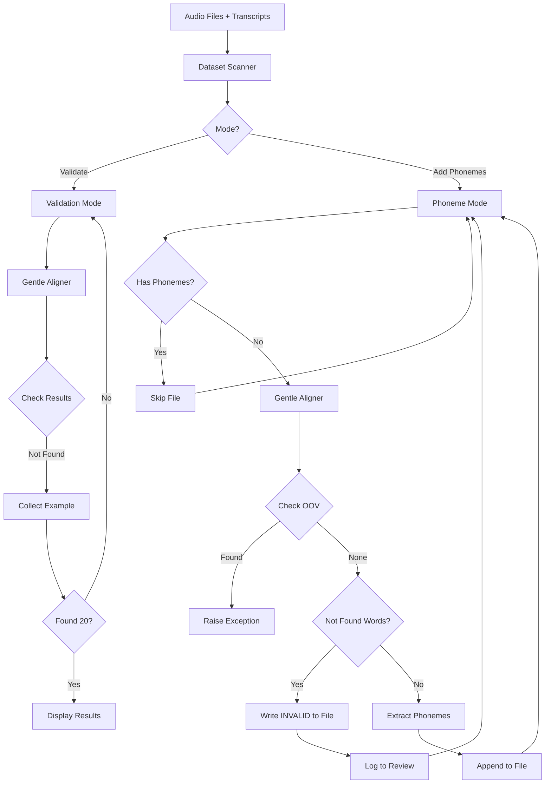

# Gentle Phoneme Alignment Implementation Plan

## Overview

This project will integrate Gentle forced aligner with the speechline lexicon to process audio files from Bookbot and Common Voice datasets. The system will validate transcripts against audio and add phoneme transcriptions to existing transcript files.

## Architecture

### Data Sources

1. **Bookbot Dataset**: `/mnt/Store07/Bookbot` (all subdirectories starting with `en-`)
2. **Common Voice Dataset**: `/mnt/Store07/Common Voice/cv-corpus-22.0-2025-06-20/en/clips`

Each audio file has a corresponding `.txt` transcript file with the same base name.

### Gentle Integration

**Gentle Installation**: `/mnt/Projects/Projects/AudioProcessing/gentle`

**Lexicon File**: `/mnt/Projects/Projects/AudioProcessing/gentle/exp/langdir/phones/align_lexicon.txt`

**Key Components**:
- `gentle.forced_aligner.ForcedAligner` - Main alignment class
- `gentle.resources.Resources` - Resource management
- Uses custom lexicon from speechline (`data/align_lexicon.txt`)

## Implementation Plan

### Phase 1: Lexicon Replacement

#### Task 1.1: Backup Original Lexicon
```bash
cp /mnt/Projects/Projects/AudioProcessing/gentle/exp/langdir/phones/align_lexicon.txt \
   /mnt/Projects/Projects/AudioProcessing/gentle/exp/langdir/phones/align_lexicon.txt.backup
```

#### Task 1.2: Install Speechline Lexicon
```bash
cp /mnt/Projects/Projects/AudioProcessing/speechline/data/align_lexicon.txt \
   /mnt/Projects/Projects/AudioProcessing/gentle/exp/langdir/phones/align_lexicon.txt
```

#### Task 1.3: Verify Installation
- Test Gentle alignment with sample audio
- Confirm no OOV errors
- Validate phoneme output format

### Phase 2: Script Architecture

#### Script: `scripts/gentle_phoneme_alignment.py`

**Mode 1: Validation Mode** (`--mode validate`)
- Scan data directories for audio files
- Perform forced alignment on each transcript
- Detect "not-found-in-audio" words
- Stop after finding 20 examples per dataset
- Display results with word-level details

**Mode 2: Phoneme Addition Mode** (`--mode add-phonemes`)
- Process all audio files in datasets
- Skip files with existing phoneme transcripts
- Perform forced alignment
- Extract phoneme sequence
- Append phonemes to transcript file (line 2)
- Raise exception on OOV detection

### Phase 3: Core Components

#### Component 3.1: Gentle API Wrapper

```python
class GentleAligner:
    """Wrapper for Gentle forced aligner"""
    
    def __init__(self, gentle_path: str):
        """Initialize with path to Gentle installation"""
        self.resources = Resources()
        
    def align(self, audio_path: str, transcript: str) -> dict:
        """
        Perform forced alignment
        
        Returns:
            {
                'words': [
                    {
                        'word': 'hello',
                        'case': 'success',  # or 'not-found-in-audio'
                        'phones': [
                            {'phone': 'hh_B', 'start': 0.0, 'end': 0.1},
                            {'phone': 'eh_I', 'start': 0.1, 'end': 0.2},
                            ...
                        ]
                    },
                    ...
                ]
            }
        """
        
    def check_oov(self, result: dict) -> bool:
        """Check if result contains OOV words"""
        
    def extract_phonemes(self, result: dict) -> str:
        """Extract space-separated phoneme sequence"""
```

#### Component 3.2: Dataset Scanner

```python
class DatasetScanner:
    """Scan directories for audio/transcript pairs"""
    
    def scan_bookbot(self, base_path: str) -> Iterator[Tuple[str, str]]:
        """Yield (audio_path, transcript_path) for Bookbot en-* dirs"""
        
    def scan_common_voice(self, clips_path: str) -> Iterator[Tuple[str, str]]:
        """Yield (audio_path, transcript_path) for Common Voice"""
        
    def has_phoneme_transcript(self, transcript_path: str) -> bool:
        """Check if transcript file already has phonemes (2 lines)"""
```

#### Component 3.3: Transcript Manager

```python
class TranscriptManager:
    """Manage transcript file operations"""
    
    def read_transcript(self, path: str) -> str:
        """Read text transcript from file"""
        
    def has_phonemes(self, path: str) -> bool:
        """Check if file has 2 lines (text + phonemes)"""
        
    def add_phonemes(self, path: str, phonemes: str):
        """Append phoneme line to transcript file"""
        
    def validate_write(self, path: str):
        """Verify write was successful"""
```

### Phase 4: Validation Mode Implementation

#### Task 4.1: Not-Found-In-Audio Detection

**Algorithm**:
1. Scan dataset for audio files
2. For each audio file:
   - Read corresponding transcript
   - Perform Gentle alignment
   - Check word-level results for `case='not-found-in-audio'`
   - If found, collect example
3. Stop after finding 20 examples per dataset
4. Display results

**Output Format**:
```
=== BOOKBOT DATASET - Not-Found-In-Audio Examples ===

Example 1:
  File: /mnt/Store07/Bookbot/en-us/sample_001.wav
  Transcript: The quick brown fox jumps
  Not Found: ['fox', 'jumps']
  
Example 2:
  File: /mnt/Store07/Bookbot/en-us/sample_042.wav
  Transcript: Hello world from here
  Not Found: ['from']

...

=== COMMON VOICE DATASET - Not-Found-In-Audio Examples ===

Example 1:
  File: /mnt/Store07/Common Voice/.../clip_001.mp3
  Transcript: This is a test sentence
  Not Found: ['test']

...
```

### Phase 5: Phoneme Addition Mode Implementation

#### Task 5.1: Main Processing Loop

**Decision**: Sequential processing with logging for not-found-in-audio cases

**Algorithm**:
1. Scan dataset for audio files
2. For each audio file:
   - Check if transcript already has phonemes (skip if yes)
   - Read transcript text
   - Perform Gentle alignment
   - **Check for OOV** - raise exception if found
   - Check for not-found-in-audio words
     - If found: Write "INVALID_TRANSCRIPT: not-found-in-audio=[words]" to line 2
     - Log to manual review file
     - Continue to next file
   - If valid: Extract phoneme sequence (simple format, no markers)
   - Append phonemes to transcript file (line 2)
   - Log success
3. Summary statistics at end

**Manual Review Log Format** (`phoneme_alignment_review.txt`):
```
File: /path/to/audio.wav
Transcript: The quick brown fox
Not Found Words: ['fox']
Reason: Words not found in audio during forced alignment
---
```

#### Task 5.2: Phoneme Format

**Decision**: Use simple phones without position markers

**Input** (Gentle output with position markers):
```
hh_B eh_I l_I ow_E w_B er_I l_I d_E
```

**Output** (simple phones without markers):
```
hh eh l ow w er l d
```

**Implementation**:
```python
def strip_position_markers(phoneme: str) -> str:
    """Remove position markers (_B, _I, _E, _S) from phoneme"""
    return phoneme.split('_')[0]
```

#### Task 5.3: File Format

**Valid Alignment - Before** (1 line):
```
Hello world
```

**Valid Alignment - After** (2 lines):
```
Hello world
hh eh l ow w er l d
```

**Invalid Alignment - After** (2 lines with error marker):
```
The quick brown fox
INVALID_TRANSCRIPT: not-found-in-audio=['fox']
```

**Reasons for Invalid Transcript**:
- Words not found in audio during forced alignment
- Partial alignment failures
- Audio quality too poor for alignment

**Invalid Format Options**:
- `INVALID_TRANSCRIPT: not-found-in-audio=['word1', 'word2']`
- `INVALID_TRANSCRIPT: alignment_failed`
- `INVALID_TRANSCRIPT: error_message`

### Phase 6: Error Handling

#### Task 6.1: OOV Detection

```python
class OOVError(Exception):
    """Raised when Out-Of-Vocabulary word is found"""
    def __init__(self, word: str, audio_path: str):
        self.word = word
        self.audio_path = audio_path
        super().__init__(
            f"OOV word '{word}' found in {audio_path}. "
            f"This should not happen with align_lexicon.txt!"
        )
```

**Detection Logic**:
- Check Gentle result for OOV markers
- If found, immediately raise OOVError
- Stop all processing
- Log full context for debugging

#### Task 6.2: File I/O Safety

- Use atomic writes (write to temp, then rename)
- Verify file exists before reading
- Validate write was successful
- Handle permission errors gracefully

### Phase 7: Command-Line Interface

#### Script Usage

```bash
# Validation mode - find not-found-in-audio examples
python scripts/gentle_phoneme_alignment.py \
    --mode validate \
    --bookbot-path /mnt/Store07/Bookbot \
    --cv-clips-path "/mnt/Store07/Common Voice/cv-corpus-22.0-2025-06-20/en/clips" \
    --gentle-path /mnt/Projects/Projects/AudioProcessing/gentle

# Phoneme addition mode - process all files
python scripts/gentle_phoneme_alignment.py \
    --mode add-phonemes \
    --bookbot-path /mnt/Store07/Bookbot \
    --cv-clips-path "/mnt/Store07/Common Voice/cv-corpus-22.0-2025-06-20/en/clips" \
    --gentle-path /mnt/Projects/Projects/AudioProcessing/gentle \
    --review-log phoneme_alignment_review.txt

# Process only Bookbot
python scripts/gentle_phoneme_alignment.py \
    --mode add-phonemes \
    --bookbot-path /mnt/Store07/Bookbot \
    --gentle-path /mnt/Projects/Projects/AudioProcessing/gentle

# Process only Common Voice
python scripts/gentle_phoneme_alignment.py \
    --mode add-phonemes \
    --cv-clips-path "/mnt/Store07/Common Voice/cv-corpus-22.0-2025-06-20/en/clips" \
    --gentle-path /mnt/Projects/Projects/AudioProcessing/gentle
```

### Phase 8: Testing Strategy

#### Test 8.1: Lexicon Verification
- Align 10 sample files
- Confirm no OOV errors
- Verify phoneme output format

#### Test 8.2: Validation Mode
- Run on small subset (100 files)
- Verify not-found detection works
- Check output format

#### Test 8.3: Phoneme Addition
- Test on 20 files
- Verify files updated correctly
- Confirm skip logic works (no duplicate processing)
- Test OOV exception handling

#### Test 8.4: Edge Cases
- Empty transcripts
- Very long transcripts
- Special characters in transcripts
- Missing audio files
- Corrupted audio files

## Performance Considerations

### Optimization Strategies

**Current Implementation**: Sequential processing for reliability and debugging

**Future Enhancements**:
1. **Parallel Processing**: Can be added later with multiprocessing
2. **Progress Tracking**: Show progress every N files (e.g., every 100 files)
3. **Batch Logging**: Log in batches to reduce I/O
4. **Error Recovery**: Continue processing on non-fatal errors
5. **Checkpointing**: Save progress periodically for large datasets
6. **Resume Capability**: Skip already processed files on restart

### Expected Performance

- Gentle alignment: ~1-5 seconds per file
- Bookbot dataset: ~50,000 files × 3 sec = ~40 hours
- Common Voice: ~1,000,000 clips × 3 sec = ~800 hours
- **Recommendation**: Start with validation mode on subset

## Data Flow Diagram



## Success Criteria

### Phase 1: Lexicon Setup
- ✅ Original lexicon backed up
- ✅ New lexicon installed
- ✅ Test alignment successful (no OOV)

### Phase 2: Validation Mode
- ✅ Finds 20 Bookbot examples with not-found-in-audio
- ✅ Finds 20 Common Voice examples with not-found-in-audio
- ✅ Displays word-level details correctly

### Phase 3: Phoneme Addition
- ✅ Processes files without existing phonemes
- ✅ Skips files with existing phonemes
- ✅ Appends correct phoneme sequences for valid alignments
- ✅ Writes INVALID_TRANSCRIPT marker for failed alignments
- ✅ Raises exception on OOV

### Phase 4: Robustness
- ✅ Handles file I/O errors gracefully
- ✅ Logs progress clearly
- ✅ Provides useful error messages

## Decisions Made

1. **Phoneme format**: ✅ Simple phones without position markers (e.g., `hh eh l ow`)
2. **Processing strategy**: ✅ Sequential processing (parallel can be added later)
3. **Not-found handling**: ✅ Log files with not-found-in-audio words to manual review file
4. **Progress tracking**: Log every N files with summary statistics

## Next Steps

Now that planning is complete, we can proceed to implementation:

1. **Switch to Code mode** to implement the solution
2. **Backup Gentle lexicon** and install speechline lexicon
3. **Test lexicon replacement** with sample alignment
4. **Implement main script** [`scripts/gentle_phoneme_alignment.py`](../../scripts/gentle_phoneme_alignment.py)
5. **Test validation mode** to find 20 examples from each dataset
6. **Run phoneme addition mode** to process full datasets

Ready to switch to Code mode for implementation!