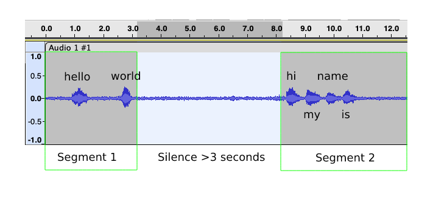
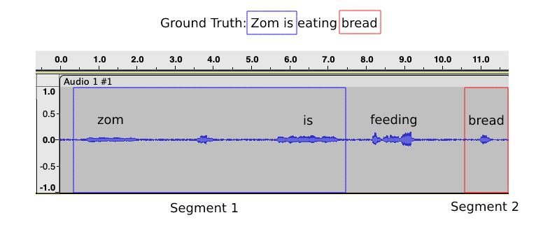
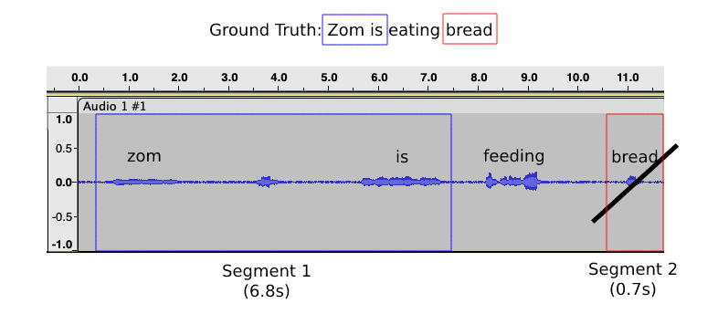

# SpeechLine Pipeline Explained

This guide will explain the SpeechLine pipeline (`speechline/run.py`) in detail: what it does, the different components, and how you can customize it's behaviour.

!!! info

    This guide was written for SpeechLine v0.0.2. There may be changes in the API in the coming releases.

## Overview

<figure markdown>
  
  
</figure>

As shown in the diagram above, SpeechLine will:

1. Load raw audio data (in a specific folder structure).
2. Format raw data as a Pandas DataFrame, with additional metadata.
3. Convert the Pandas DataFrame into a HuggingFace `Dataset` object.
4. Pass the `Dataset` into a child/adult audio classifier (optional).
5. Pass the `Dataset` into an audio transcriber.
6. Segment audio into smaller chunks, with customizable strategies.
7. Export audio chunks into clean audio-transcript pairs.

## 1. Data Loading

SpeechLine expects raw audio data to be structured as such:

```
{INPUT_DIR}
├── {lang-region}
    ├── {speaker}_{utterance}.wav
    ├── {speaker}_{utterance}.txt
    ...
├── {lang-region}
    ├── {speaker}_{utterance}.wav
    ├── {speaker}_{utterance}.txt
    ...
...
```

where audio are grouped by their languages, in `.wav` format, and could be of any sample rate (they will be resampled on-the-fly, if needed). Audio files must have the naming convention of `{speaker}_{utterance}.wav`.

**Optionally**, they could have their corresponding ground truth transcripts in a separate `.txt` file of the same name, if you'd like to later segment it with [`Word Overlap Segmenter`](../../reference/segmenters/word_overlap_segmenter).

For example, it should look something like

```
dropbox/
└── en-us
    ├── bob_001.wav
    ├── bob_001.txt
    ├── bob_002.wav
    ├── alice_001.wav
    ├── alice_001.txt
    └── alice_002.wav
└── en-au
    ├── tom_001.wav
    └── tom_001.txt
```

## 2. Pandas DataFrame

If you have structure you're files as outlined above, it will then be loaded as a Pandas DataFrame with the following structure:

| `audio`                     | `id`      | `language` | `language_code` | `ground_truth`       |
| --------------------------- | --------- | ---------- | --------------- | -------------------- |
| dropbox/en-us/bob_001.wav   | bob_001   | en         | en-us           | hi, my name is bob.  |
| dropbox/en-us/bob_002.wav   | bob_002   | en         | en-us           |                      |
| dropbox/en-us/alice_001.wav | alice_001 | en         | en-us           | hey how are you?     |
| dropbox/en-us/alice_002.wav | alice_002 | en         | en-us           |                      |
| dropbox/en-au/alice_001.wav | tom_001   | en         | en-au           | zom is eating bread. |

Notice that there are several entries of `ground_truth` which are empty. That's because the audio files does not have a corresponding `.txt` file, hence it's assumed that the audio has no expected ground truth text which was spoken.

!!! warning

    If you're going to segment with the [`Silence Segmenter`](../../reference/segmenters/silence_segmenter), this is perfectly fine as it does not rely on a separate ground truth text to verify the transcriber's outputs. However, if you're going to use [`Word Overlap Segmenter`](../../reference/segmenters/word_overlap_segmenter), it will immediately assume that your audio is empty, as assumed from the ground truth.

    Moreover, in the [Config](../../reference/config), you could specify `"filter_empty_transcript": true`, and it will immediately drop all audios that have empty transcripts. These will then be ignored in the next stage of the pipeline.

More details can be found in [`Audio Dataset`](../../reference/utils/dataset).

## 3. HuggingFace `Dataset`

The conversion from a Pandas DataFrame to a HuggingFace `Dataset` is as simple as

```py
dataset: Dataset = Dataset.from_pandas(df)
```

and that it does absolutely nothing other than interfacing the DataFrame into a format that HuggingFace recognizes.

Though it actually does one more thing behind the scene. Namely, it takes the `audio` column and tells HuggingFace that it's actually going to be an audio file. `Datasets` will later automatically read the audio file as an audio array, and even resample it if necessary. But upfront, it does not need extra attention.

## 4. Audio Classification

If you have set `"do_classify": true` in your `config.json` file, SpeechLine will classify your audio files as adult or child audio. Subsequently, only child-classified audio will be selected.

You can also change the classifier model (by specifying the its Huggingface Hub model checkpoint) and its configuration in `config.json`, like so:

```json
{
    "do_classify": true,
    "classifier": {
        "model": "bookbot/distil-wav2vec2-adult-child-cls-52m",
        "max_duration_s": 3.0 // (1)
    }
}
```

1. This refers to the maximum length to which your audio tensors were padded to during training, but in seconds. So if your sampling rate is 16kHz and you padded your tensors to a maximum length of 16000, then `max_duration_s = 1.0`. This follows the preprocessing explained [here](https://huggingface.co/docs/transformers/tasks/audio_classification#preprocess).

Your custom classification model must have a `"child"` label, which will be used to filter the DataFrame like so:

```py
df = df[df["category"] == "child"]
```

## 5. Audio Transcription

Once the data preprocessing and the optional classification are complete, SpeechLine will proceed to transcribe your audio files. SpeechLine supports 2 transcription models, namely `wav2vec` or `whisper`. You will have to specify the `return_timestamps` config that is unique to both of these models. An example trascriber config may look like this:

```json
{
    "transcriber": {
        "type": "wav2vec2", // (1)
        "model": "bookbot/wav2vec2-bookbot-en-lm", // (2)
        "return_timestamps": "word", // (3)
        "chunk_length_s": 30 // (4)
    },
}
```

1. Type of model, either `wav2vec2` or `whisper`. Additional architectures might be supported in future versions of SpeechLine.
2. HuggingFace model checkpoint found in the Hub.
3. Timestamp level. Either `word` or `char` for wav2vec 2.0, or `True` for Whisper.
4. Maximum length of audio chunk for long-audio transcription.

For `wav2vec2`, you have the option to use either `char` or `word`. This depends on the type of transcriber model that you have and subsequently the type of label that you want the output audio to have.

If you have the usual word-level wav2vec2 model like [Wav2Vec2-Base-960h](https://huggingface.co/facebook/wav2vec2-base-960h), and want your output audio to have word-level timestamps, then set `"return_timestamps": "word"`. It will result in timestamps that look like:

```json
[
  {
    "end_time": 1.7,
    "start_time": 1.68,
    "text": "A"
  },
  {
    "end_time": 2.72,
    "start_time": 2.64,
    "text": "YOU"
  },
  {
    "end_time": 2.96,
    "start_time": 2.82,
    "text": "SEE"
  },
  {
    "end_time": 3.4,
    "start_time": 3.32,
    "text": "AN"
  }
]
```

Otherwise, if you want character-level timetamps, then set `"return_timestamps": "char"`. It will result in timestamps that look like:

```json
[
  {
    "text": "f",
    "start_time": 1.62,
    "end_time": 1.66
  },
  {
    "text": "i",
    "start_time": 1.7,
    "end_time": 1.72
  },
  {
    "text": "t",
    "start_time": 1.78,
    "end_time": 1.8
  },
  {
    "text": "p",
    "start_time": 1.8,
    "end_time": 1.82
  },
  {
    "text": "l",
    "start_time": 1.86,
    "end_time": 1.88
  },
  {
    "text": "i",
    "start_time": 1.92,
    "end_time": 1.94
  }
]
```

If you use `whisper`, set `return_timestamps` to `True`. Whisper, by design, only supports utterance-level or sentence-level timestamps. So expect that your timestamps will also therefore be sentence-level. It may look something like:

```json
[
  {
    "end_time": 1.7,
    "start_time": 6.82,
    "text": "The quick brown fox jumps over the lazy dog."
  },
  {
    "end_time": 7.01,
    "start_time": 10.5,
    "text": "Never gonna give you up."
  }
]
```

The remaining transcriber config is the chunk length in seconds. This is used in transcribing long audios that may cause out-of-memory issues. We won't discuss it in detail, but you can read more about it [here](https://huggingface.co/blog/asr-chunking). Simply put, this is the maximum audio duration that the transcriber will infer. Anything more than that, then the audio will be divided into chunks of even lengths, and the transcription will be the joint predictions of each chunk.

## 6. Audio Segmentation

After transcription, SpeechLine will segment your audio files into smaller chunks. SpeechLine employs 2 different segmentation strategies, namely through *silence gaps* or *word overlaps*.

To segment based on silence gaps, simply set `"type": "silence"` and specify the `silence_duration` (in seconds) in the segmenter config. Here is an example of segmenter config with the silence gap strategy:

```json
{
    "segmenter": {
        "type": "silence",
        "silence_duration": 3.0,
        "minimum_chunk_duration": 1.0
    }
}
```

The config above will tell SpeechLine to split your audio files on every point of at least 3-second silence gaps. 

<figure markdown>
  
</figure>

In the diagram above, the audio will be split into two chunks because there is at least a 3-second silence gap in between the two chunks. One chunk will therefore contain the audio for `"hello world"` and the other `"hi my name is"`.

Alternatively, you can set `"type": "word_overlap"` to use to word overlap segmenation strategy. Here is an example of such config:

```json
{
    "segmenter": {
        "type": "word_overlap",
        "minimum_chunk_duration": 1.0
    }
}
```

As explained in the previous sections, this method relies on having a corresponding "ground truth" text, or what the audio is expected to contain. 

<figure markdown>
  
</figure>

In the diagram above, the algorithm matches `"zom is"` to its corresponding segment that the transcriber predicts as `"zom is"`, and the same for `"bread"`. However, since there is no match for the word `"eating"`, the segment in between will not be accepted. There might be two possibilities for this:

1. The speaker mis-said 'eating' as 'feeding', or
2. The transcriber mis-labeled 'eating' as 'feeding'.

For the case (1), this is perfectly fine as we don't want to produce incorrect labels in the resultant output data, and word overlap ensures cases like these are filtered. However, if case (2) is true, then our transcriber is inaccurate.

!!! info
    For the latter, this can only be fixed by using a more accurate transcription model, and fine-tuning wav2vec2 on your audio domain should improve it for this purpose.

Ultimately, word overlap is more strict in a sense that it requires an agreement between the expected ground truth and the transcriber. As per our experiments, this resulted in a dataset of higher quality. The only cases where this is unreliable is if our transcriber predicts a false positive, but this is seemingly quite rare.

More details can be found in [`Silence Segmenter`](../../reference/segmenters/silence_segmenter) and [`Word Overlap Segmenter`](../../reference/segmenters/word_overlap_segmenter).

## 7. Chunk Exporting

Lastly, `"minimum_chunk_duration"` refers to the minimum chunk duration (in seconds) to be exported.

<figure markdown>
  
</figure>

Continuing the example and using the config above, the second segment will not be exported since it is less than the minimum 1.0 second. On the contrary, the first segment is longer than 1.0 second and will therefore be exported.

## Resultant Output Dataset

Once the pipeline has finished running, you will end up with an output directory that looks like the following:

```
{OUTPUT_DIR}
├── {lang-region}
    ├── {speaker}_{utterance}.wav
    ├── {speaker}_{utterance}.tsv
    ...
├── {lang-region}
    ├── {speaker}_{utterance}.wav
    ├── {speaker}_{utterance}.tsv
    ...
...
```

For example:

```
training/
└── en-us
    ├── bob_001.wav
    └── bob_001.tsv
└── en-au
    ├── tom_001.wav
    └── tom_001.tsv
```

The `.wav` file corresponds to the exported chunks, while the `.tsv` file contains the timestamped-transcript that is of the format:

```
{start_time_in_secs}\t{end_time_in_secs}\t{label}
```

For example:

```
12.28	12.42	THIS
12.54	12.9	POINTED
13.06	13.44	STRAIGHT
13.66	13.72	AT
13.82	13.96	HIM
14.92	15.02	ONE
15.14	15.34	GOOD
15.58	15.78	SHE
16.0	16.26	SHOULD
16.4	16.72	DEAL
16.94	17.14	HIM
```

which you can then pass to other models to train with.